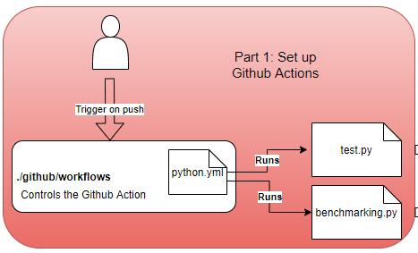

# Setting up an initial action to test the workflow

For our initial setup, we are gonna create a simple "Hello World" action. We accomplish this by creating a Python file by running the following commands in the terminal:

`cat <<EOM> test.py`

> `print("Hello you're running your first action on a commit!")`
 
>`EOM`

To execute GitHub Actions, a '.github/workflows' directory is required in the repository to execute the action. We create the '.github/workflows' directory in our repository running the following commands in the terminal:

`mkdir .github`

`mkdir .github/workflows`

The actions are executed from a YML file in 'workflows/' directory. We therefore need to create our own workflow file by running:

``` touch .github/workflows/python.yml```

Then edit the '.github/workflows/python.yml' file using your favorite text editor by inserting the following into the file:
```
name: Python benchmarking using pytest
on: push
jobs:
        benchmark:
                name: pytest-benchmarking
                runs-on: ubuntu-latest
                steps:
```
`name` is the name of our workflow which is displayed in the actions page on GitHub

`on` is the name of the GitHub event that triggers the workflow. In our case, the workflow will be triggered on a <ins>push</ins> to the repository.

`jobs` A workflow run is made up of jobs, but in the action only one is required so we won't need to distinguish between having multiple. We then specify the name of the job as `pytest-benchmarking`. 

`runs-on` is the type of machine to run the job on, which in this case will be the latest version of Ubuntu.

`steps` is the sequence of tasks the job will run, which we will define now. Under steps write the following lines:

```
 steps:
        - uses: actions/checkout@v2
            with:
                persist-credentials: false
                fetch-depth: 0 
        - uses: actions/setup-python@v1
        - name: Installing and running pytest
            run: |
                pwd
                python -m pip install --upgrade pip
                if [ -f requirements.txt ]; 
                then pip install -r requirements.txt; fi
                python test.py
                pytest benchmarking.py --benchmark-json output.json
                python data/generate_output.py

```
Step 1: Check-out GitHub repository

`uses: actions/checkout@v2` is an action that checks-out our repository under $GITHUB_WORKSPACE, so our workflow can access it.

`persist-credentials: false` We need a GitHub auth token to enable our scripts to run authenticated git commands. This auth token is removed during post-job clean up by default. This command allows us to opt-out of this so that our auth token is persistent.

`fetch-depth: 0` By default, only a single commit is fetched. This command allows us to fetch all history for all branches and tags.

The documentation for the checkout action is available [here](https://github.com/actions/checkout)

Step 2: Set up Python environment and run script

`uses: actions/setup-python@v1` is an action that sets up a Python environment that we can use for our action. It gives us the ability to download, install and set up Python packages.

`pwd` Prints the current working directory

`python -m pip install --upgrade pip` Updates pip to the latest version in our environment. Pip is a package installer for Python.

`
 if [ -f requirements.txt ]; 
 then pip install -r requirements.txt; fi
`
These commands install the dependencies we need for our action using pip. The dependencies are defined in he requirements.txt file which we will create later.

The full documentation is available [here](https://docs.github.com/en/actions/reference/workflow-syntax-for-github-actions)
